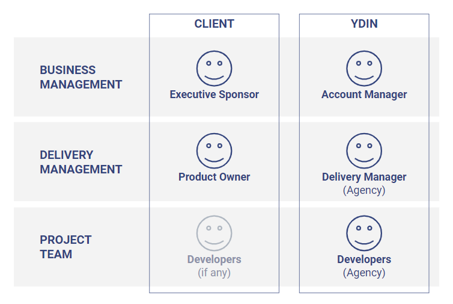

# Roles and responsibilities

**Key roles with responsibilities for every project, named in the Project Resourcing Contract.**

## Client

### Executive Sponsor

- Business responsible on the Client side
- Approves and signs the YDIN Terms of Services for Clients on behalf of the client company
- Signs the Project Resourcing Contract for the project
- Ensures approved invoices are paid correctly and on time

### Product Owner

- Responsible for the outcomes of the Project on the Client side
- Approves the developers for the project
- Owns and prioritizes the project backlog
- Day-to-day management of the Project Team
- Approves the reported hours for invoicing

### Developers (if any)

- A named person or persons allocated to support the Project Team (Individual Specialists and Complete Team models)
- The Client team that the developers work in (Team Extension model)
- No one (Individual Specialists and Complete Team models)
- Especially in a smaller company, the Executive Sponsor and Product Owner can be often the same person.

## YDIN

### Account Manager

- YDIN business responsible for the project
- Ensures project resourcing proposal matches client's needs
- Contract negotiations
- Project steering group
- Invoicing
- Dispute resolution
 
### Delivery Manager (Agency)

- Pricing and project contract proposal sign-off
- Project team resourcing, changes, and replacements
- Local support for the project team in software development
- Local working environment, processes, and tools as agreed in the Project Resourcing Contract
- Ensure reported hours are correct before invoicing
- Client communications related to management of the resources
- HR/Team management
 
### Developers (Agency)

- One or more developers working for the Client
